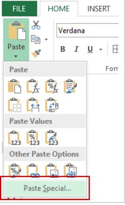

### What is Paste Special
Within Excel copy and paste is a very helpful tool. Everybody knows ctrl+c is copy and ctrl+v is paste. Paste special allows the user to choose specific elements of a copied cell and perform mathematical operations with the copied data. Essentially if you have a spreadsheet of data with different formulas and you want to copy and paste those values to another part of the spreadsheet it will be incorrect. Paste Special allows for you to do this with no problems.

### Why is Paste Special useful
When you have formulas within a spreadsheet, often times those values will have to be copied and put into another spot on the spreadsheet or an entirely different spreadsheet.  Paste special is magical when it comes to this.  When you copy and paste values from a cell there is typically a formula associated with calculating that value. When you go to paste the values in another cell, they turn to the number 0. This is because these cells are looking at the wrong spots within the spreadsheet. The cells right next to where you copy and paste from dont have a formula associated with it. Paste special allows you to customize how you want to copy and paste. Anoither reason why people use paste special is for time management and efficiency. The transpose tool within paste special is also very helpful because it puts data horizantally instead of vertically. This provides a different way to present the data.
### Step 1:
The very first step is to copy multiple cells from your data set with ctrl-c. Next you should navigate to the home tab on the ribbon and locate Paste icon and click the small arrow.



## Header 2
### Header 3

- Bulleted
- List

1. Numbered
2. List

**Bold** and _Italic_ and `Code` text

[Link](url) and 
```

For more details see [Basic writing and formatting syntax](https://docs.github.com/en/github/writing-on-github/getting-started-with-writing-and-formatting-on-github/basic-writing-and-formatting-syntax).

### Jekyll Themes

Your Pages site will use the layout and styles from the Jekyll theme you have selected in your [repository settings](https://github.com/ColeDoh/AdvancedDataScience/settings/pages). The name of this theme is saved in the Jekyll `_config.yml` configuration file.

### Support or Contact

Having trouble with Pages? Check out our [documentation](https://docs.github.com/categories/github-pages-basics/) or [contact support](https://support.github.com/contact) and we’ll help you sort it out.
